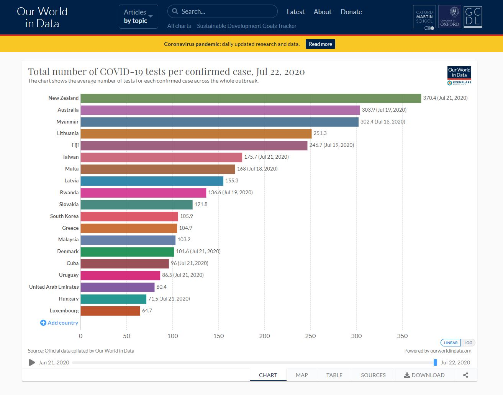
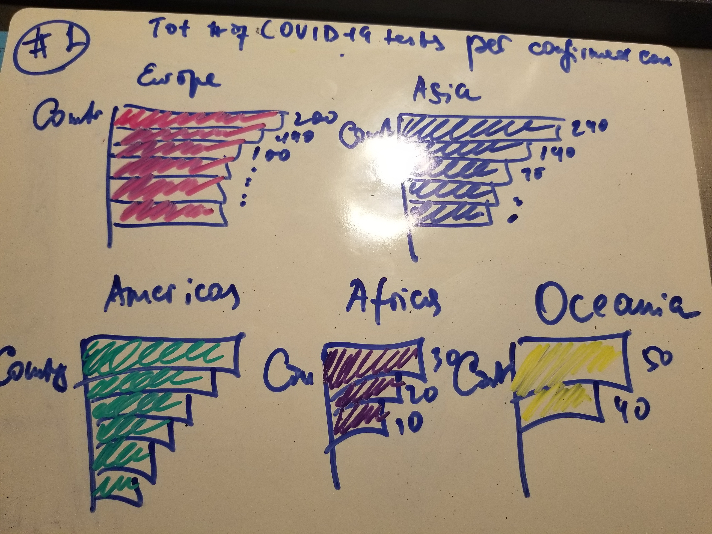
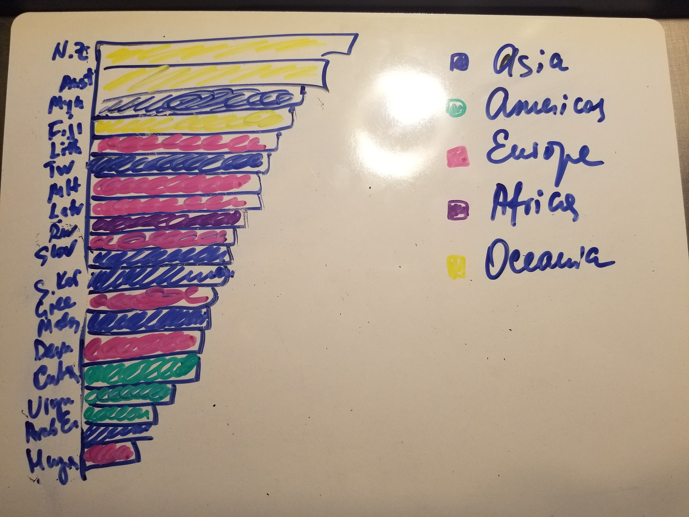
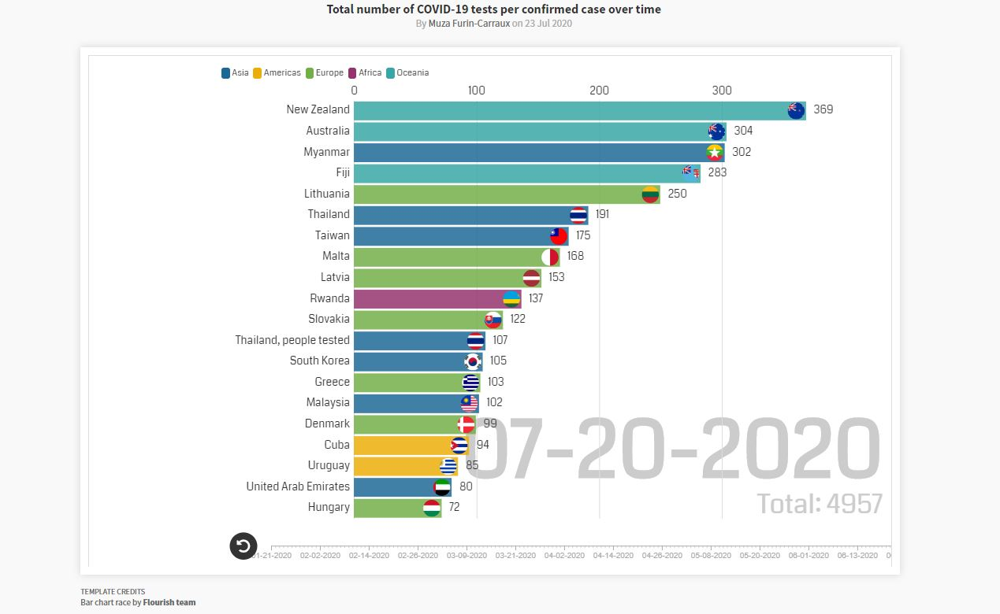

# Why I chose this visualization: 

The visualization that I chose to improve and critique came from Our World in Data. I decided to look at a total number of Covid-19 tests per confirmed case. Right now all COVID-19 graphs and charts seem to appear in media every day. Coronavirus seems to be a rather hot topic being discussed all over the world. Everyone would like to see new trends and new stats. 

The name of the chart: ["Total number of COVID-19 tests per confirmed case".](
 https://ourworldindata.org/grapher/covid-tests-per-case-exemplars?time=2020-07-22&country=AUS~CUB~DNK~FJI~GRC~HUN~India%2C%20people%20tested~LVA~LTU~LUX~MYS~MLT~MMR~NZL~RWA~SVK~KOR~TWN~THA~ARE~URY)
 

 
 
# What I think of the original bar chart: 

The bar chart that I chose for my assignments 3 & 4 is an interactive bar chart, in which each bar represents a country with a number of tests per a confirmed case.   

Once I found and looked at this visualization, I really liked it. Personally, I like bar charts for their simplicity. This particular chart falls under the category of data-driven/exploratory because it is interactive, it shows trends and focuses on real, existing data. 

Overall, the visualization is interactive, informative and emotive. As it says in the book ‘Good Charts’, “exploration lends itself to interactivity - allowing a manger to adjust parameters, inject data sources, and continually visualize” (Berinato, S., 63). 

# My recommendations: 

However, there are a few things that could be improved. Even though I like the original visualization, a few things are missing or could be enhanced. 
Based on the feedback that I received from my colleagues and my own inclination to do it as well, I grouped countries by region. I think it improved the focus on the critical idea of how regions compare to each other.  

Also, I removed dates at the end of the bar that eventually helps increase a focus on the number of tests and countries, but not dates. In my opinion, there is no need to put the exact dates. The bar chart is interactive and shows the last day when tests were conducted.  

One more thing that really helps with distinguishing countries is adding country flags to each bar. Sitting at the right end of the bar next to values help audience track change of a number of tests per each country as the animation goes. 

As one of my colleagues mentioned, adding totals would also improve the visualization. I was also wondering if I needed to add them. Once I heard the feedback from him, I thought to myself that it does resonate with my initial thought as well. Adding totals at the bottom of the bar chart helps keep track of tests performed for selected countries.
  
# Wireframes

As I was working on wireframes, I tried to work on two types of visualization – creating sets of different bar charts by regions and sketching all bars together and breaking them down by regions with colors. I sent two sets of sketches to my colleagues and based on the feedback, I decided to use one set of bars coloring countries in accordance with their region belonging. In short, I decided to go with sketch #2.  

And that

# My Solution

Find the complete animation here [https://public.flourish.studio/visualisation/3251136/](https://public.flourish.studio/visualisation/3251136/)

# Sources: 
* [Our World in Data. How experts use data to identify emerging Covid-19 success stories. June 30 2020.](https://ourworldindata.org/identify-covid-exemplars). Last accessed 22 July 2020. 
* Berinato, S. Good Charts: The HBR Guide to Making Smarter, More Persuasive Data Visualizations. 2016. 

# Main portfolio
[Return to main portfolio page](README.md)
